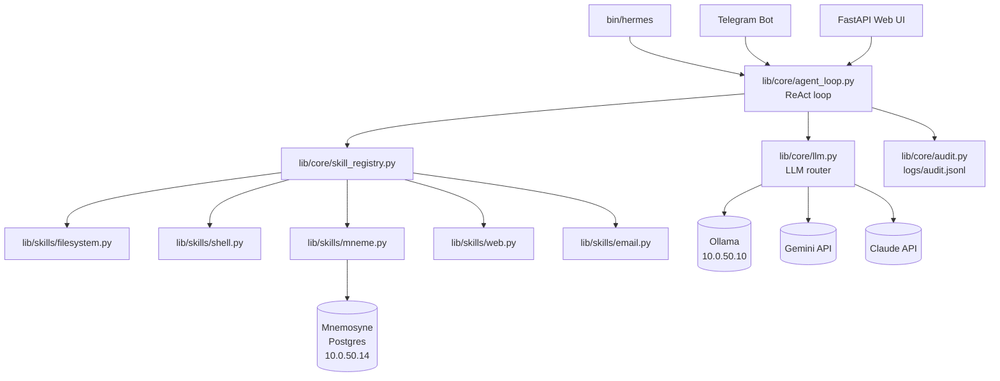

# Hermes Design Doc v1.1

Local AI agent for homelab automation and personal productivity. Part of the Homelab Command
ecosystem (alongside Argus, Ariadne, Orpheus, and Mnemosyne).

---

## Table of Contents

1. [Current Status](#current-status)
2. [Purpose](#purpose)
3. [Architecture](#architecture)
4. [Build Phases](#build-phases)
5. [LXC Specification](#lxc-specification)
6. [Network and IP Assignment](#network-and-ip-assignment)
7. [Dependencies](#dependencies)
8. [Deployment Order](#deployment-order)
9. [Repository Layout](#repository-layout)

---

## Current Status — ⚠️ On Hold

As of 2026-04-27, Hermes is on hold. Phase 2 is complete but not reliably functional — the
ReAct loop times out on CPU-only Ollama hardware, and the Gemini free tier has been
eliminated. Active development is paused until a hold trigger condition is met:

- Bug Bounty Validation produces a successful outcome (VDP accepted or paid bounty)
- Hexxus Web Solutions onboards a new client
- Jan 1 2027 — hard expiry; Hermes shuttered if neither above has occurred

Phase 3 architecture direction: replace the ReAct loop with single-shot classification +
n8n workflow dispatch for simple tasks. See `apps/hermes/THOUGHTS.md` for full rationale.

---

## Purpose

See `docs/homelab-philosophy-v1.0.md` for the broader goals this service supports. Hermes serves
the skill-building and automation goals: making the homelab more capable of managing itself while
building practical experience with agentic AI systems.

Hermes acts as the "hands" of the homelab - it receives tasks in natural language and executes
them autonomously using a ReAct (Reason + Act) loop. Tasks arrive via:

- **Phase 1**: CLI (`bin/hermes "do something"`)
- **Phase 3**: Telegram bots (one per context - personal and professional)
- **Phase 4**: FastAPI web UI (domain → context routing)

Hermes is context-aware. Each context (`personal`, `professional`) carries its own allowed
filesystem paths, whitelisted shell commands, LLM model preferences, email credentials, and
style guide injections. Switching context changes all of these at once.

Long-term information (notes, project state, decisions) is persisted in Mnemosyne
(git-backed wiki at `~/mneme/wiki/`) rather than local files. Hermes's local state is intentionally ephemeral.

---

## Architecture

### Component overview

The following diagram shows the major components and how they interact.



### Core modules

| Module | Role |
|--------|------|
| `lib/core/agent_loop.py` | ReAct loop - thinks, picks tool, acts, observes, repeats |
| `lib/core/context.py` | `Context` dataclass; loads and validates context YAML |
| `lib/core/llm.py` | LLM clients + tier router (Ollama → Gemini → Claude) |
| `lib/core/skill_registry.py` | Registers skills; resolves tool names to callables |
| `lib/core/audit.py` | Appends every tool call and LLM invocation to `logs/audit.jsonl` |

### Skill modules

| Module | Phase | Description |
|--------|-------|-------------|
| `lib/skills/filesystem.py` | 1 | Scoped file read/write/list (path allowlist enforced) |
| `lib/skills/shell.py` | 1 | Whitelisted command execution |
| `lib/skills/mneme.py` | 2 | Store and retrieve from Mnemosyne Postgres + pgvector |
| `lib/skills/web.py` | 2 | `fetch_url`, web search |
| `lib/skills/email.py` | 2 | PurelyMail IMAP/SMTP |
| `lib/skills/n8n_mcp.py` | 5 | n8n MCP client |

### Interface modules

| Module | Phase | Description |
|--------|-------|-------------|
| `lib/interfaces/cli.py` | - | Future rich interactive UI |
| `lib/interfaces/telegram_bot.py` | 3 | Telegram bots (personal + professional) |
| `lib/interfaces/web_app.py` | 4 | FastAPI web UI; the endpoint the systemd unit runs |

### LLM tier routing

Hermes uses a three-tier LLM waterfall. Each context sets thresholds on a 0–10 complexity scale:

1. **Tier 1 - Ollama** (local, free): tasks below `ollama_max_complexity`
2. **Tier 2 - Gemini** (API, cheap): tasks between the two thresholds
3. **Tier 3 - Claude** (API, expensive): tasks above `gemini_max_complexity`, or when forced

The professional context uses lower thresholds (escalates sooner) for higher-quality output.

### Style guide injection

Each context YAML lists `style_guides` - paths to brand or tone guide files. These are read at
startup and prepended verbatim to every system prompt. This ensures consistent tone and
formatting without manual prompting.

---

## Build Phases

| Phase | Status | Contents |
|-------|--------|----------|
| 1 | Complete | CLI, Ollama, filesystem skill, shell skill, audit log |
| 2 | Complete | Gemini + Claude, LLM router, wiki skill, HTTP endpoint, async ingest, Telegram callback |
| 3 | Deferred | Telegram bots — pending hold trigger; architecture direction revised (see THOUGHTS.md) |
| 4 | Deferred | FastAPI web UI, domain → context routing |
| 5 | Deferred | n8n MCP integration (n8n deployed at 10.0.50.13) |

### Phase 3 pre-requisite

Register two Telegram bots via [@BotFather](https://t.me/BotFather) before implementing:

1. `/newbot` → name: `Hermes Personal` → username: `sirhexxus_hermes_bot`
2. `/newbot` → name: `Hermes Professional` → username: `hexxusweb_hermes_bot`

Tokens go into `config/contexts/personal.yml` and `config/contexts/professional.yml` under
`telegram_token`. In production, these are injected by Ansible Vault.

---

## LXC Specification

| Property | Value |
|----------|-------|
| VMID | 110 |
| Hostname | `hermes` |
| IP | 10.0.50.17/24 |
| Gateway | 10.0.50.1 |
| VLAN | 50 (Lab Services) |
| vCPU | 2 |
| RAM | 4 GB |
| Disk | 20 GB |
| OS | Ubuntu 22.04 |
| Python | 3.12 (deadsnakes PPA) |
| Service user | `hermes:hermes` |
| Install path | `/opt/hermes/` (git clone of `homelab-command`) |
| App path | `/opt/hermes/apps/hermes/` |
| Config path | `/opt/hermes/apps/hermes/config/` |
| Log path | `/opt/hermes/apps/hermes/logs/` |

The service unit runs uvicorn on port 8765. Until Phase 4 is implemented, the service file
exists but the endpoint will return 404 - CLI and Telegram interfaces work independently.

---

## Network and IP Assignment

Hermes sits on VLAN 50 (Lab Services) alongside the other homelab services.

| Service | IP |
|---------|----|
| Ollama | 10.0.50.10 |
| **Hermes** | **10.0.50.17** |
| Mnemosyne (Postgres) | 10.0.50.14 |
| n8n | 10.0.50.13 |

---

## Dependencies

| Dependency | Why |
|------------|-----|
| Ollama (10.0.50.10) | Tier 1 LLM inference - must be running before Hermes starts |
| Mnemosyne Postgres (10.0.50.14) | Skill - gracefully skipped if unreachable (Phase 1) |
| Gemini API key | Phase 2 - not needed for Phase 1 |
| Telegram bot tokens | Phase 3 - not needed for Phase 1–2 |

---

## Deployment Order

1. **Terraform**: `cd infrastructure/hermes/terraform && terraform apply`
2. **Wait** ~60 seconds for the container to boot
3. **Ansible provision**: `cd infrastructure/hermes/ansible && ansible-playbook -i inventory.ini provision.yml --ask-vault-pass`
4. **Verify**: `curl http://10.0.50.17:8765/health`

For ongoing updates after any `git push` to `homelab-command`:

```bash
ansible-playbook -i inventory.ini update.yml --ask-vault-pass
```

The `update.yml` playbook does `git pull` in `/opt/hermes/`, reinstalls Python dependencies, and
restarts the service. This is the only step needed after code changes.

---

## Repository Layout

Hermes lives entirely within `homelab-command`, split across three top-level trees:

```text
homelab-command/
├── apps/hermes/          ← application source (Python)
│   ├── bin/hermes
│   ├── lib/{core,skills,interfaces}/
│   ├── config/           ← .example files only; real configs templated by Ansible
│   └── tests/
│
├── infrastructure/hermes/
│   ├── terraform/        ← LXC provisioning
│   └── ansible/          ← OS + app configuration
│       └── roles/hermes/ ← install, venv, config, systemd
│
└── docs/hermes-design-doc-v1.0.md   ← this file
```

This separation keeps deployment machinery (`infrastructure/`) distinct from application source
(`apps/`) and documentation (`docs/`). The `apps/` convention is reusable for any future custom
application in this ecosystem.
