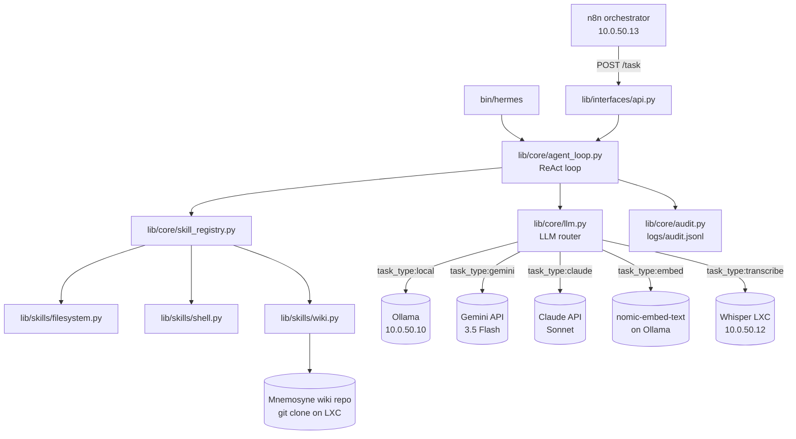

# Hermes Design Doc v1.1

Hermes is the homelab's **autonomous-execution subsystem** — the container for all
automation functions that should run without human (Layer 5) initiation. It encapsulates
Layers 1–4 of the [Five-Layer AI Stack](#five-layer-stack-positioning) for any task given
over to autonomous execution. Part of the Homelab Command ecosystem (alongside Argus,
Ariadne, Orpheus, and Mnemosyne).

Design target: OpenClaw-style autonomy. Given a task, Hermes executes mostly
independently. The human's role is goal-setting and audit, not step-by-step direction.

---

## Table of Contents

1. [Current Status](#current-status)
2. [Purpose](#purpose)
3. [Five-Layer Stack Positioning](#five-layer-stack-positioning)
4. [Architecture](#architecture)
5. [Build Phases](#build-phases)
6. [LXC Specification](#lxc-specification)
7. [Network and IP Assignment](#network-and-ip-assignment)
8. [Dependencies](#dependencies)
9. [Deployment Order](#deployment-order)
10. [Repository Layout](#repository-layout)

---

## Current Status

**Active (off hold 2026-05-20).** The hold imposed 2026-04-27 was lifted via direct Gemini
API billing on a personal account ($5/month hard cap), after `gemini-3.5-flash` was
quality-validated against the real Mnemosyne Daily Digest prompt.

Phase 1 (CLI) and Phase 2 (HTTP endpoint, LLM router, wiki skill, LXC deployment) are
complete. The LXC is live at 10.0.50.17 with `/health` returning 200. The next
forward-motion gate is the **Decide First Mnemosyne and Hermes Build Sprint** selection
on 2026-06-01, choosing among:

- GeminiClient refactor against the `gemini-creds.json` pattern
- Daily Digest `claude -p` → `gemini-3.5-flash` direct API swap
- Mnemosyne Phase 2 ingest pipeline kickoff (target path, replacing the interim cron path)
- ReAct-loop scope reduction (single-shot dispatch for simple tasks)

See `apps/hermes/ToDo.md` Post-Hold-Lift Candidates and the wiki journal entry
"2026-05-20 — Hermes Off Hold and Orient Inventory" for full context.

---

## Purpose

See `docs/homelab-philosophy-v1.0.md` for the broader goals this service supports. Hermes
serves the skill-building and automation goals: making the homelab more capable of managing
itself while building practical experience with agentic AI systems.

Hermes acts as the "hands" of the homelab — it receives tasks and executes them
autonomously. Tasks arrive via:

- **CLI** (Phase 1, done): `bin/hermes "do something"`
- **HTTP endpoint** (Phase 2, done): `POST /task` from n8n on VLAN 50

Note that user-facing chat surfaces (Telegram, web UI) are *not* directly inside Hermes:

- **Telegram** is owned by n8n's Telegram Trigger node, which HTTP-POSTs into Hermes.
  A Hermes-internal Telegram bot was planned for Phase 3 and is **superseded** by this
  architecture. May be revisited if other agents need a direct user channel.
- **FastAPI web UI** (Phase 4, deferred): a future user-facing surface for context-routed
  interaction; not in scope for the autonomous-execution surface.

Hermes is context-aware. Each context (`personal`, `professional`) carries its own allowed
filesystem paths, whitelisted shell commands, LLM model preferences, email credentials, and
style guide injections. Switching context changes all of these at once.

Long-term information (notes, project state, decisions) is persisted in Mnemosyne
(git-backed wiki at `~/mneme/wiki/`) rather than local files or a database. Hermes's local
state is intentionally ephemeral.

---

## Five-Layer Stack Positioning

Hermes encapsulates Layers 1–4 of the homelab's Five-Layer AI Stack for any task given
over to autonomous execution. The stack itself is defined in the Mnemosyne wiki page
`[[Five-Layer AI Stack]]`; this section describes Hermes's slice.

| Layer | Hermes scope |
|-------|--------------|
| **Layer 4** — Orchestration & Reasoning | Gemini (reasoning, synthesis), Claude (judgment), n8n (workflow routing) |
| **Layer 3** — Specialization | Whisper (transcription), nomic-embed-text (embeddings) when invoked from autonomous flows |
| **Layer 2** — Manipulation | Scripts and workflow steps that execute as part of autonomous runs (deterministic logic, API calls, file operations) |
| **Layer 1** — Foundation | Configuration, prompts, and documentation used exclusively by autonomous flows |
| Layer 5 — Pure Abstraction | **Out of scope.** The human sets goals and audits; Hermes does not own this layer. |

**What this means for design decisions:** if a task is initiated without a human pulling
the trigger, it likely belongs inside Hermes. If a human pulls the trigger, it's likely
outside (CLI sessions, direct Claude Code sessions, user-facing UIs). Tools shared between
autonomous and human paths (the wiki itself, Whisper LXC, MinIO) live outside Hermes;
Hermes invokes them but does not own them.

The architectural principle is layer discipline: tasks should be handled at the lowest
layer capable of handling them. Inside Hermes specifically, this drives the Phase 3
direction toward single-shot classification for simple tasks, reserving the ReAct
multi-step loop for genuine judgment work (see `[[AI Agents Are the Wrong Abstraction
Layer]]`).

---

## Architecture

### Component overview



User-facing Telegram traffic enters the n8n side, not Hermes — n8n's Telegram Trigger
node converts messages to HTTP POSTs against `/task`.

### Core modules

| Module | Role |
|--------|------|
| `lib/core/agent_loop.py` | ReAct loop — thinks, picks tool, acts, observes, repeats |
| `lib/core/context.py` | `Context` dataclass; loads and validates context YAML |
| `lib/core/ingest.py` | `IngestItem` dataclass — normalized ingestion envelope |
| `lib/core/llm.py` | LLM clients + task_type-driven router (see [LLM tier routing](#llm-tier-routing)) |
| `lib/core/skill_registry.py` | Registers skills; resolves tool names to callables |
| `lib/core/audit.py` | Appends every tool call and LLM invocation to `logs/audit.jsonl` |

### Skill modules

| Module | Phase | Description |
|--------|-------|-------------|
| `lib/skills/filesystem.py` | 1 — done | Scoped file read/write/list (path allowlist enforced) |
| `lib/skills/shell.py` | 1 — done | Whitelisted command execution |
| `lib/skills/wiki.py` | 2 — done | Mnemosyne wiki read/write/commit (7 skills registered; filelock on `git_commit_push`) |
| `lib/skills/_archive/mneme_postgres.py` | — | Archived. Postgres/pgvector implementation predating the Mnemosyne wiki pivot. Do not use or adapt. |
| `lib/skills/web.py` | future | `fetch_url`, web search |
| `lib/skills/email.py` | future | PurelyMail IMAP/SMTP |
| `lib/skills/n8n_mcp.py` | future | n8n MCP client |

### Interface modules

| Module | Phase | Description |
|--------|-------|-------------|
| `bin/hermes` | 1 — done | CLI entrypoint |
| `bin/hermes-api` | 2 — done | API server entrypoint (gunicorn on port 8765) |
| `lib/interfaces/api.py` | 2 — done | Minimal HTTP endpoint: `POST /task`, `GET /health`. Bearer token auth, internal VLAN 50 only. |
| `lib/interfaces/web_app.py` | 4 — deferred | FastAPI web UI; domain → context routing. Do not build early. |
| ~~`lib/interfaces/telegram_bot.py`~~ | — | **Superseded.** n8n owns the Telegram surface and HTTP-POSTs into Hermes. May be revisited if other agents need a direct user channel. |

### LLM tier routing

Routing is **task_type-driven**, not complexity-score-driven. The agent or caller declares
the task type; the router resolves the appropriate model tier from config and executes
the call. Config lives in `apps/hermes/config/config.yml` under `model_routing:`.

| Task type | Default tier | Pinned model |
|-----------|-------------|--------------|
| `classify`, `wiki_read` | local | Qwen3 on Ollama (10.0.50.10) |
| `wiki_write`, `synthesis`, `report` | gemini | `gemini-3.5-flash` (pinned, not `-latest`) |
| `judgment` | claude | Claude Sonnet |
| `embed` | nomic | `nomic-embed-text` on Ollama — never cloud |
| `transcribe` | whisper | Whisper LXC (10.0.50.12) — never cloud |

**Why Gemini 3.5 Flash is pinned, not `-latest`:** quality-validated against the real
Mnemosyne Daily Digest prompt on 2026-05-20. Cost ~$0.0072/run; ~$0.22/month at 30 daily
runs. `-latest` would silently update the model under the system; pinning avoids
unannounced behavior changes.

**Selective escalation candidate (deferred):** `gemini-3.1-pro-preview` for Idea Synthesis
only. ~5× the cost per run due to mandatory thinking budget; preview status makes it
unsafe for production cron jobs without a deprecation watch. Wait until Idea Synthesis is
actually built before committing. Per-report routing will need a `model_overrides` map in
`gemini-creds.json` when that time comes.

**Re-evaluation point:** Gemini 3.5 Pro GA (~June 2026). If quality is competitive and
pricing reasonable, may become the default and retire the Flash/Pro split entirely.

**Fixed-destination tiers (`nomic`, `whisper`):** never escalate. Embeddings must be
generated by the same model consistently — switching breaks existing vectors. Whisper has
no cloud equivalent in this stack; sending audio to a cloud API would be a privacy
regression.

**Credentials pattern:** `gemini-creds.json` (0600, JSON pointer file). Siblings:
`weather-creds.json`, `telegram-creds.json`. Replaces the env-var-only pattern from the
original Phase 2 GeminiClient. Refactor pending — see `apps/hermes/ToDo.md` Post-Hold-Lift
Candidates.

### Style guide injection

Each context YAML lists `style_guides` — paths to brand or tone guide files. These are
read at startup and prepended verbatim to every system prompt. This ensures consistent
tone and formatting without manual prompting. The Mnemosyne wiki's `SCHEMA.md` is loaded
this way for any task in the `wiki_*` family.

---

## Build Phases

| Phase | Status | Contents |
|-------|--------|----------|
| 1 | Complete | CLI, Ollama, filesystem skill, shell skill, audit log |
| 2 | Complete | Gemini + Claude clients, task_type LLM router, `wiki.py`, HTTP endpoint, IngestItem, async ingest, n8n integration |
| 3 | Active candidate | Single-shot dispatch + ReAct scope reduction (one of several candidates feeding the 2026-06-01 Decide gate) |
| 4 | Deferred | FastAPI web UI, domain → context routing |
| 5 | Deferred | n8n MCP integration |

### Phase 3 direction — single-shot dispatch

The ReAct loop failure during Phase 2 testing (10-step safety limit, Ollama timeouts at
300s on CPU-only inference) was diagnostic: the multi-step agent loop is over-engineered
for most Mnemosyne ingest tasks. Classifying a note, choosing a bucket, and writing a wiki
page is a deterministic routing operation, not a reasoning problem.

Recommended direction:

- Replace the ReAct loop with single-shot classification for simple tasks (one LLM call:
  classify, extract title and summary, return JSON)
- Dispatch to n8n workflows rather than baking routing logic into Python (n8n handles
  branching, retries, integrations; Hermes stays thin)
- Reserve the ReAct loop for genuinely complex judgment tasks (synthesis, conflict
  resolution, Argus alert triage) where multi-step reasoning is actually needed

This is one of the candidates competing in the 2026-06-01 Decide gate — not pre-committed.
See `[[AI Agents Are the Wrong Abstraction Layer]]` for the broader architectural framing
and the OpenClaw evaluation.

---

## LXC Specification

| Property | Value |
|----------|-------|
| VMID | 110 |
| Hostname | `hermes` |
| IP | 10.0.50.17/24 |
| Gateway | 10.0.50.1 |
| VLAN | 50 (Lab Services) |
| vCPU | 2 |
| RAM | 4 GB |
| Disk | 20 GB |
| OS | Ubuntu 22.04 |
| Python | 3.12 (deadsnakes PPA) |
| Service user | `hermes:hermes` |
| Install path | `/opt/hermes/` (git clone of `homelab-command`) |
| App path | `/opt/hermes/apps/hermes/` |
| Config path | `/opt/hermes/apps/hermes/config/` |
| Log path | `/opt/hermes/apps/hermes/logs/` |

The service unit runs `bin/hermes-api` (Flask + gunicorn) on port 8765. `GET /health`
returns 200 and `POST /task` accepts the IngestItem envelope. Bearer token auth via the
`HERMES_API_TOKEN` env var injected by Ansible Vault.

---

## Network and IP Assignment

Hermes sits on VLAN 50 (Lab Services) alongside the other homelab services.

| Service | IP | Note |
|---------|----|----|
| Ollama | 10.0.50.10 | Tier 1 LLM inference; nomic-embed-text also hosted here |
| Whisper | 10.0.50.12 | Fixed-destination transcription |
| n8n | 10.0.50.13 | Workflow orchestration; owns the Telegram bot frontend |
| Postgres (shared platform) | 10.0.50.14 | Not used by Mnemosyne — see note below |
| **Hermes** | **10.0.50.17** | This service |

**Note on Mnemosyne storage:** earlier versions of this document listed
`Mnemosyne (Postgres) | 10.0.50.14`. Mnemosyne pivoted to a git-backed markdown wiki in
April 2026; the shared Postgres at 10.0.50.14 remains a platform service but is no longer
Mnemosyne's primary store. The wiki lives at `~/mneme/wiki/` locally and is cloned onto
the Hermes LXC at `/opt/hermes/wiki/`.

---

## Dependencies

| Dependency | Why |
|------------|-----|
| Ollama (10.0.50.10) | Tier 1 LLM inference; `nomic-embed-text` for embeddings; must be running before Hermes starts |
| Mnemosyne wiki repo | Cloned onto the LXC at `/opt/hermes/wiki/`; read/written by `wiki.py` skill |
| Whisper LXC (10.0.50.12) | Audio transcription — fixed destination, never routed elsewhere |
| n8n (10.0.50.13) | Multi-step workflow orchestration; primary inbound caller via `POST /task` |
| Gemini API | Primary cloud tier for wiki writes, synthesis, reports; credentials via `gemini-creds.json` |
| Claude API | Cloud tier for judgment tasks; credentials via env var (creds.json migration pending) |
| `HERMES_API_TOKEN` | Bearer token for `POST /task`; injected by Ansible Vault on the LXC |

---

## Deployment Order

1. **Terraform**: `cd infrastructure/hermes/terraform && terraform apply`
2. **Wait** ~60 seconds for the container to boot
3. **Ansible provision**: `cd infrastructure/hermes/ansible && ansible-playbook -i inventory.ini provision.yml --ask-vault-pass`
4. **Verify**: `curl http://10.0.50.17:8765/health`

For ongoing updates after any `git push` to `homelab-command`:

```bash
ansible-playbook -i inventory.ini update.yml --ask-vault-pass
```

The `update.yml` playbook does `git pull` in `/opt/hermes/`, reinstalls Python
dependencies, and restarts the service. This is the only step needed after code changes.

---

## Repository Layout

Hermes lives entirely within `homelab-command`, split across three top-level trees:

```text
homelab-command/
├── apps/hermes/          ← application source (Python)
│   ├── bin/
│   │   ├── hermes        ← CLI entrypoint
│   │   └── hermes-api    ← API server entrypoint (gunicorn)
│   ├── lib/{core,skills,interfaces}/
│   ├── config/           ← .example files only; real configs templated by Ansible
│   └── tests/
│
├── infrastructure/hermes/
│   ├── terraform/        ← LXC provisioning
│   └── ansible/          ← OS + app configuration
│       └── roles/hermes/ ← install, venv, config, systemd
│
└── docs/hermes-design-doc-v1.1.md   ← this file
```

This separation keeps deployment machinery (`infrastructure/`) distinct from application
source (`apps/`) and documentation (`docs/`). The `apps/` convention is reusable for any
future custom application in this ecosystem.
